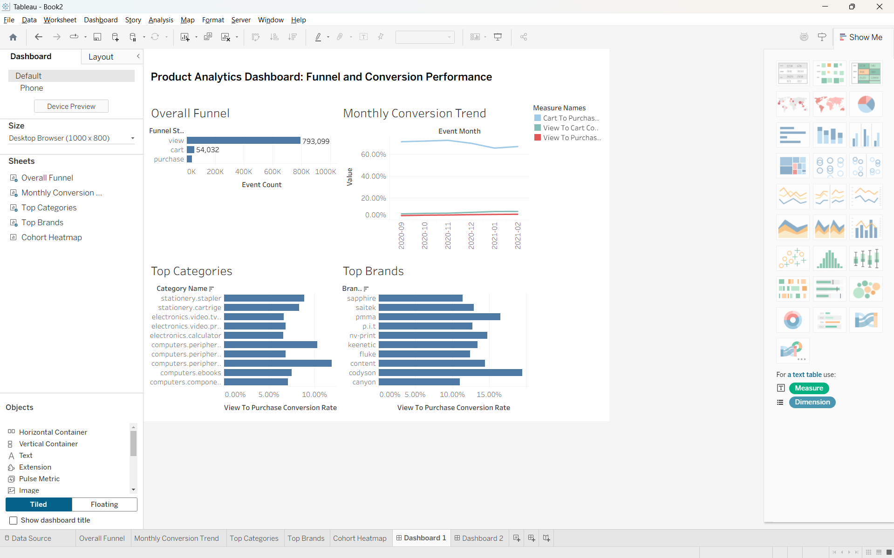
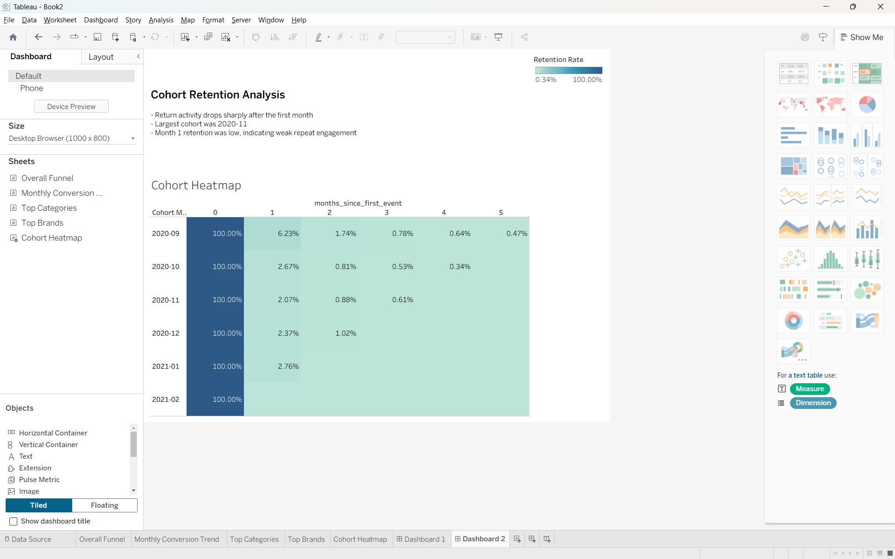

# Product Analytics Dashboard with Cohort Analysis

## Project Overview
This project analyzes user behavior in an electronics eCommerce dataset to understand conversion performance and retention patterns. The goal was to build a practical, business-focused product analytics case study that goes beyond simple data cleaning or plotting.

The project answers questions such as:
- Where is the biggest drop-off in the funnel?
- How do conversion rates change over time?
- Which categories and brands perform better?
- How well do users return after their first activity?

The final output includes cleaned analytics datasets, analysis notebooks, dashboard-ready CSV files, and Tableau dashboards.

---

## Business Objective
The purpose of this project is to simulate the type of product and business analysis done by analytics teams in eCommerce and digital product companies.

The analysis focuses on two core business problems:
1. **Funnel performance** — understanding how users move from product view to cart to purchase.
2. **Retention performance** — understanding whether users return after their first observed activity.

---

## Dataset
**Dataset used:** `eCommerce events history in electronics store`

This dataset contains event-level user interaction data from an online electronics store.

Large raw and cleaned dataset files are not tracked in this repository due to GitHub file size limits. The raw dataset file `data/events.csv` and the cleaned full dataset file `outputs/events_cleaned.csv` are excluded. The repository includes notebooks, processed dashboard-ready outputs, screenshots, and Tableau assets needed to understand the analysis workflow.

### Main fields used
- `event_time`
- `event_type`
- `product_id`
- `category_id`
- `category_code`
- `brand`
- `price`
- `user_id`
- `user_session`

### Event types
- `view`
- `cart`
- `purchase`

---

## Tools and Technologies
- **Python**
- **pandas**
- **Jupyter Notebook**
- **Tableau**
- **VS Code**
- **GitHub**

---

## Project Workflow

### 1. Data Inspection
The raw dataset was inspected to understand:
- shape
- columns
- data types
- date range
- missing values
- event type distribution

### 2. Data Cleaning
The dataset was cleaned by:
- converting `event_time` to datetime
- checking duplicates
- validating numeric fields
- handling missing `brand` and `category_code`
- creating:
  - `event_date`
  - `event_month`
  - `event_week`

### 3. Funnel Analysis
Funnel metrics were calculated for:
- overall performance
- monthly trends
- category-level performance
- brand-level performance

Core metrics included:
- total views
- total carts
- total purchases
- view-to-cart conversion rate
- cart-to-purchase conversion rate
- view-to-purchase conversion rate

### 4. Cohort Retention Analysis
A monthly cohort analysis was built using each user's first observed event month. Retention percentages were calculated across subsequent months and visualized as a cohort heatmap.

### 5. Dashboard Preparation
Final dashboard-ready summary tables were created for Tableau, including:
- KPI summary
- funnel summary
- monthly trends
- category performance
- brand performance
- cohort heatmap table

### 6. Dashboard Creation
Two Tableau dashboards were built:
- **Dashboard 1:** Funnel and Conversion Performance
- **Dashboard 2:** Cohort Retention Analysis

---

## Key Findings

### Funnel Findings
- Total views: **793,099**
- Total carts: **54,032**
- Total purchases: **37,343**
- View-to-cart conversion: **6.81%**
- Cart-to-purchase conversion: **69.11%**
- View-to-purchase conversion: **4.71%**

**Main insight:**  
The biggest drop-off happens between **view** and **cart**, while users who reach the cart stage convert at a relatively strong rate.

### Retention Findings
- Cohort months analyzed: **6**
- Largest cohort: **2020-11**
- Average month 1 retention: **3.22%**
- Average month 2 retention: **1.11%**

**Main insight:**  
User return activity drops sharply after the first month, suggesting weak repeat engagement.

### Category and Brand Findings
- Conversion rates vary meaningfully across product categories and brands.
- High-performing categories and brands may indicate stronger product intent, better product-market fit, or more efficient conversion behavior.

---

## Dashboard Outputs

### Dashboard 1: Funnel and Conversion Performance
Includes:
- overall funnel
- monthly conversion trend
- top categories by purchase conversion
- top brands by purchase conversion

### Dashboard 2: Cohort Retention Analysis
Includes:
- monthly cohort retention heatmap
- retention insights summary

> Add your Tableau screenshots here after exporting them.

Example:





## Project Structure
```text
product_analytics_cohort/
│
├── data/
│   └── events.csv
│
├── notebooks/
│   ├── 01_data_inspection.ipynb
│   ├── 02_data_cleaning.ipynb
│   ├── 03_funnel_analysis.ipynb
│   ├── 04_cohort_retention.ipynb
│   ├── 05_dashboard_prep.ipynb
│   └── executed notebook versions
│
├── outputs/
│   ├── events_cleaned.csv
│   ├── funnel_overall.csv
│   ├── funnel_monthly.csv
│   ├── funnel_category.csv
│   ├── funnel_brand.csv
│   ├── cohort_counts.csv
│   ├── cohort_retention_matrix.csv
│   ├── cohort_retention_percentages.csv
│   └── dashboard_ready/
│       ├── kpi_summary.csv
│       ├── funnel_summary.csv
│       ├── monthly_trends.csv
│       ├── category_performance.csv
│       ├── brand_performance.csv
│       └── cohort_heatmap.csv
│
├── dashboard_plan.md
├── dataset_options.md
├── project_plan.md
└── README.md
```

## How to Run
1. Open the project in VS Code.
2. Use the project Python environment / interpreter.
3. Run the notebooks in order:
   - `01_data_inspection.ipynb`
   - `02_data_cleaning.ipynb`
   - `03_funnel_analysis.ipynb`
   - `04_cohort_retention.ipynb`
   - `05_dashboard_prep.ipynb`
4. Use the files inside `outputs/dashboard_ready/` to build the Tableau dashboards.
5. Open the Tableau workbook and connect the dashboard-ready CSV files if needed.

## Why This Project Matters
This project was built as a portfolio-ready analytics case study to demonstrate:
- product analytics thinking
- funnel and conversion analysis
- cohort retention analysis
- business storytelling with data
- dashboarding and reporting skills
- end-to-end workflow from raw event data to final dashboard output

It is especially relevant for internships in:
- Data Analytics
- Product Analytics
- Business Intelligence
- Data Science

## Future Improvements
Possible next steps for this project:
- add session-level funnel analysis
- apply minimum-volume thresholds more systematically for category and brand comparisons
- compare retention by acquisition segment or category
- create a public Tableau portfolio page
- extend the project with experimentation or A/B testing analysis

## Author
**Jay Sanjay Sonawane**  
Master’s in Data Science, Analytics, and Engineering  
Arizona State University
